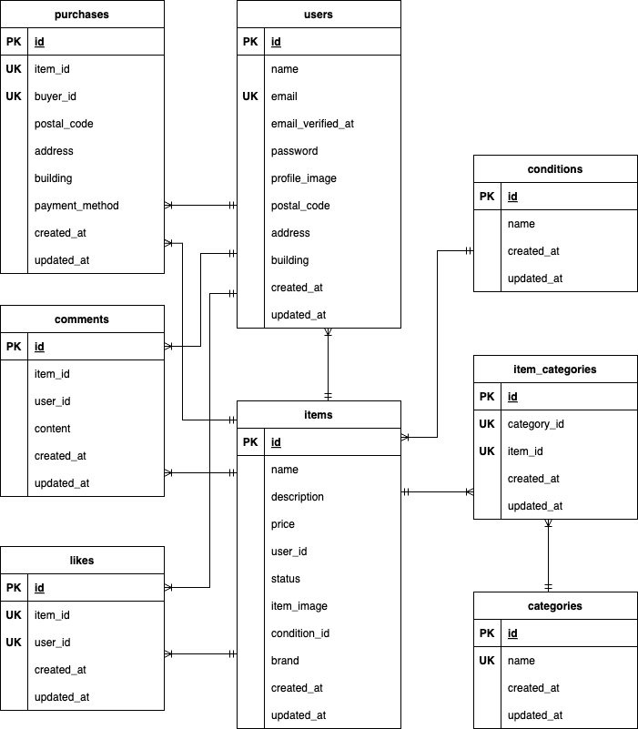

# フリマアプリ

## 環境構築
**Dockerビルド**
1. `git clone git@github.com:ichiki925/flea-market-app.git`
2. DockerDesktopアプリを立ち上げる
3. `docker-compose up -d --build`

> *MacのM1・M2・M3チップのPCの場合、`no matching manifest for linux/arm64/v8 in the manifest list entries`のメッセージが表示されビルドができないことがあります。
エラーが発生する場合は、docker-compose.ymlファイルの「mysql」内に「platform」の項目を追加で記載してください*
``` yaml
mysql:
  platform: linux/x86_64  # ← この行を追加
  image: mysql:8.0
  environment:
```

**Laravel環境構築**
1. `docker-compose exec php bash`
2. `composer install`
3. 「.env.example」ファイルを 「.env」ファイルに命名を変更。または、新しく.envファイルを作成
4. .envに以下の環境変数を追加
``` text
DB_CONNECTION=mysql
DB_HOST=mysql
DB_PORT=3306
DB_DATABASE=laravel_db
DB_USERNAME=laravel_user
DB_PASSWORD=laravel_pass

MAIL_MAILER=smtp
MAIL_HOST=mailhog
MAIL_PORT=1025
MAIL_USERNAME=null
MAIL_PASSWORD=null
MAIL_ENCRYPTION=null
MAIL_FROM_ADDRESS=no-reply@example.com
MAIL_FROM_NAME="フリマアプリ"
```
5. アプリケーションキーの作成
``` bash
php artisan key:generate
```

6. マイグレーションの実行
``` bash
php artisan migrate
```

7. シーディングの実行
``` bash
php artisan db:seed
```

## メール認証について（開発環境）

本アプリケーションでは、開発環境でのメール送信確認のために **MailHog** を使用しています。

### 🔧 MailHogの設定方法

Docker を使用している場合は、`docker-compose.yml` に MailHog のサービスが定義されています。
``` yaml
mailhog:
  image: mailhog/mailhog
  container_name: mailhog
  platform: linux/amd64
  ports:
    - "1025:1025"
    - "8025:8025"
```

## Stripeについて
コンビニ支払いとカード支払いのオプションがありますが、
コンビニ支払いを選択するとレシートを印刷する画面に遷移します。

そのため、通常の画面遷移をテストする場合は、**カード支払いを成功させてください。**

また、StripeのAPIキーは以下のように設定してください。
```
STRIPE_PUBLIC_KEY="パブリックキー"
STRIPE_SECRET_KEY="シークレットキー"
```

以下のリンクは公式ドキュメントです。<br>
https://docs.stripe.com/payments/checkout?locale=ja-JP


## 画像ファイルの準備（画像を `storage` にコピーする場合）

商品画像などを `storage/app/public/img` に配置するには、
あらかじめ `public/img/copy_storage_img` という一時フォルダに画像を入れておき、以下のコマンドで移動します。

```bash
mkdir -p ./src/storage/app/public/img
mv ./src/public/img/copy_storage_img/*.jpg ./src/storage/app/public/img

php artisan storage:link
```


## テストアカウント
name: テストユーザー1
email: test1@example.com
password: password1
-------------------------
name: テストユーザー2
email: test2@example.com
password: password2
-------------------------
name: 未出品ユーザー
email: noitems@example.com
password: password3
-------------------------


## PHPUnitを利用したテストについて
以下のコマンド:
```
docker-compose exec mysql bash
mysql -u root -p
CREATE DATABASE test_database;
exit
exit

docker-compose exec php bash
php artisan migrate:fresh --env=testing
./vendor/bin/phpunit
```


## 使用技術(実行環境)
- PHP8.3.0
- Laravel8.83.27
- MySQL8.0

## ER図



## URL
- 開発環境：http://localhost/
- phpMyAdmin：http://localhost:8080/
